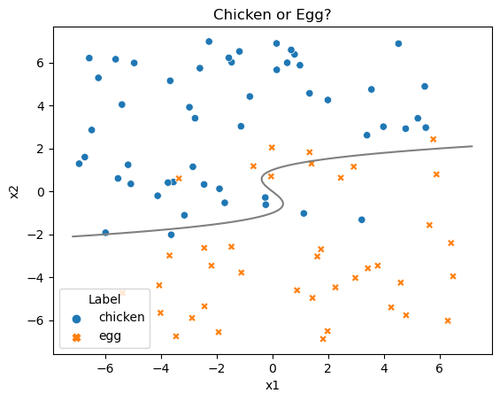
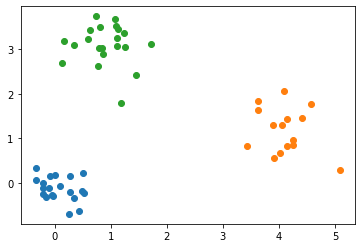
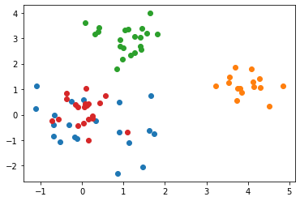
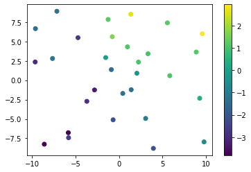
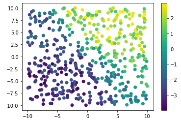
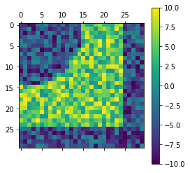
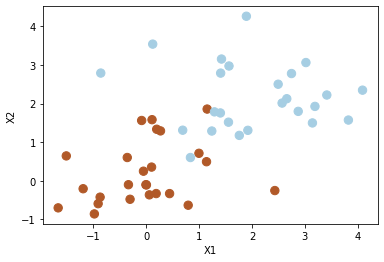
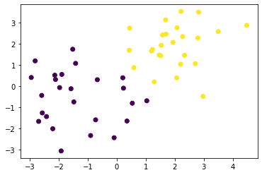
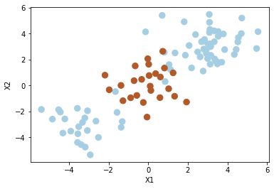

# Data sets

These data sets are largely taken from downloads of the ISLR textbook's R package. A few of them have required some modification to make it a bit easier.  I've also included some sample data sets generated for various notebooks in the lectures. Notes on each are below. For the data sets generated by Dr. Munch, the code for generation is also included.

## Advertising

TODO

## Auto

TODO

## Boston: Do not use

While I have included this data set in the folder as it is often used in the ISLR and ISLP book, we will not be using it in class.  This is due to the major [ethical concerns](https://medium.com/@docintangible/racist-data-destruction-113e3eff54a8) that have resulted in its [removal from `sklearn`](https://github.com/scikit-learn/scikit-learn/issues/16155).

## Carseats

[Link to R documentation](https://www.rdocumentation.org/packages/ISLR/versions/1.4/topics/Carseats)

## ChickenEgg 

Dr. Munch generated this data as a simple 2D classification example. The data set has inputs $x_1$ and $x_2$, with $y$ given by `Label`.
The Bayes classifier is 
$$
f(x_1,x_2) = 
\begin{cases}
\texttt{chicken} & \text{if } (x_2)^3-x_2 - x_1 >0 \\
\texttt{egg} & \text{else.}
\end{cases}
$$



The code used to generate this data is below.

```Python
def generateData(N=90,xBounds = [-7,7],yBounds = [-7,7],sigma=1, seed = None):
    # Generating data where the label is determined by being on one side or the
    # other of $y^3-y-x = 0$. 
    # Adding noise so it's not cleanly separated
    np.random.seed(seed)
    DataX = np.random.uniform(xBounds[0],xBounds[1],[N,1])
    DataY = np.random.uniform(yBounds[0],yBounds[1],[N,1])

    Data = np.concatenate([DataX,DataY], axis = 1)
    Noise = np.random.normal(0, sigma, N)
    Check = Data[:,1]**3 - 4*Data[:,1] - (Data[:,0]+Noise)
    def ChickOrEgg(z):
        if z>0:
            return 'chicken'
        else:
            return 'egg'
    Label = [ChickOrEgg(z) for z in Check]
    
    
    Data = pd.DataFrame(Data, columns = ['x1','x2'])
    Data['Label'] = Label

    return Data


# Generate the data
Data = generateData(N = 90, seed = 48824)

# Plot the figure
sns.scatterplot(data = Data, x = 'x1', y = 'x2', hue = 'Label', style = 'Label').set(title = 'Chicken or Egg?')
ty = np.linspace(-2.1,2.1,100)
tx = ty**3 - ty
plt.plot(tx,ty, color = 'grey')
```
## Clustering example data

### Clustering-toy-data

Dr. Munch made these data sets for use in the example hierarchical clustering module.



```python
np.random.seed(1)
n1 = 20
X1 = np.random.normal((0,0), .3, (n1,2))

n2 = 15
X2 = np.random.normal((4,1), .5, (n2,2))

n3 = 21
X3 = np.random.normal((1,3), .6, (n3,2))


for A in [X1,X2,X3]:
    plt.scatter(A[:,0],A[:,1])

X = np.concatenate([X1,X2,X3],axis = 0)
np.random.shuffle(X)
```

### Clustering-toy-data2



```python
np.random.seed(1)
n1 = 20
X1 = np.random.normal((0,0), 1, (n1,2))
n1b = 20
X1b = np.random.normal((0,0), 0.5, (n1b,2))

n2 = 15
X2 = np.random.normal((4,1), .7, (n2,2))

n3 = 21
X3 = np.random.normal((1,3), .5, (n3,2))


for A in [X1,X2,X3,X1b]:
    plt.scatter(A[:,0],A[:,1])

X = np.concatenate([X1,X2,X3,X1b],axis = 0)
np.random.shuffle(X)

```

## College

TODO

## Default

[Link to R documentation](https://www.rdocumentation.org/packages/ISLR/versions/1.4/topics/Default)

## Deep learning examples

### DL-toy-data


Code used for some example creations in the deep learning module. Dr. Munch generated this using the following code:

```python
w = np.array([(1,2,1),(-1,0,1),(3,-1,-1)]) #<----- Original choices 
beta = np.array((-1,2,1,-2))               #<----- of matrices

np.random.seed(0)
X = np.random.random((30,2))*20-10
y = []
for i in range(30):
    y.append(MyFirstNN(X[i,0],X[i,1],w, beta))
y = np.array(y)

ynoise = y + np.random.random(30)*2-1

data = np.concatenate((X,ynoise.reshape(-1,1)),axis = 1)
```

### DL-toy-data-bigger



```python
def MyFirstNN(X1,X2,w, beta):
    
    X = np.array((X1,X2))
    A = []
    
    for i in range(3): 
        Ai = w[i,0] + np.dot(w[i,1:],X)
        Ai = 1/(1+np.exp(-Ai))
        A.append(Ai)
    
    A = np.array(A)
    
    Y = beta[0] + np.dot(beta[1:], A)

    return Y


w = np.array([(1,2,1),(-1,0,1),(3,-1,-1)]) #<----- Original choices 
beta = np.array((-1,2,1,-2))               #<----- of matrices

np.random.seed(0)
n= 500
X = np.random.random((n,2))*20-10
y = []
for i in range(n):
    y.append(MyFirstNN(X[i,0],X[i,1],w, beta))
y = np.array(y)

ynoise = y + np.random.random(n)*2-1

data = np.concatenate((X,ynoise.reshape(-1,1)),axis = 1)
```

### DL-ToyImage



An image used to try out convolutional filters in the CNN module. Data generated using the following code:

```python
np.random.seed(48824)
M = np.random.random((30,30))
M = np.round(10*M, 1)
for i in range(30):
    for j in range(30):
        if i**2 + j**2 < 15**2:
            M[i,j] -= 10

M[25:,:] -=10
M[:25,25:]-=10
```

## Hitters

[Link to R documentation](https://www.rdocumentation.org/packages/ISLR/versions/1.4/topics/Hitters)

## OJ

[Link to R documentation](https://www.rdocumentation.org/packages/ISLR/versions/1.4/topics/OJ)

## Portfolio

[Link to R documentation](https://www.rdocumentation.org/packages/ISLR/versions/1.4/topics/Portfolio)

## Portfolio2

TODO

## Smarket

TODO

## SVM Examples

Synthetic data generated by Dr. Munch for the SVM labs.

### SVM-Data



```python
# Generating random data: 20 observations of 2 features and divide into two classes.

np.random.seed(5)
n = 50
X = np.random.randn(n,2)
y = np.repeat([1,-1], n/2) 
X[y == -1] = X[y == -1]+2

data = np.concatenate((X,y.reshape(-1,1)), axis = 1)
np.random.shuffle(data)
```

### SVM-Data2



```python
# Generating random data: 50 observations of 2 features and divide into two classes.
# This one is more spread about than original
np.random.seed(48824)
n = 50
X = np.random.randn(n,2)
y = np.repeat([1,-1], n/2) # 
X[y == -1] = X[y == -1]+2
X[y == 1] = X[y == 1]-1.5
X[:,1][y == 1] = X[:,1][y == 1]+.9
y = y*-1

data = np.concatenate((X,y.reshape(-1,1)), axis = 1)
np.random.shuffle(data)
```

### SVM-Data3

Generated to emphasize usefulness of kernel options in SVM.



```python
np.random.seed(8)
n = 100
k = int(n/4)
X = np.random.randn(n,2)
X[:2*k] = X[:2*k] +3
X[2*k+1:3*k] = X[2*k+1:3*k] -3
y = np.concatenate([np.repeat(-1, 3*k), np.repeat(1,n-3*k)])
data = np.concatenate((X,y.reshape(-1,1)), axis = 1)
```

## Wage

[Link to R documentation](https://www.rdocumentation.org/packages/ISLR/versions/1.4/topics/Wage)

## Weekly

TODO
